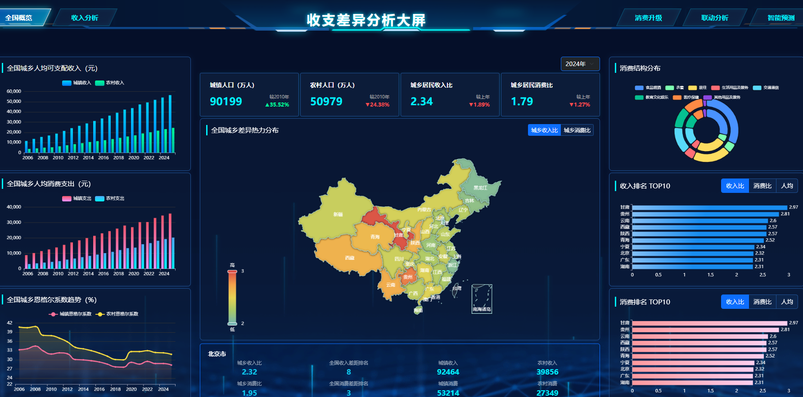

# 城乡收支差异分析系统
## A Full-stack Data Visualization Platform for Urban-Rural Disparity Analysis
- 项目周期: 2025年12月 - 2026年3月 (4个月)
- 技术栈: Python · Django · MySQL · ECharts · Bootstrap · Pandas

### 项目概览
这是一个基于Django的交互式数据可视化分析平台，旨在将复杂的宏观经济数据转化为直观、可操作的业务洞察。项目通过对中国城乡收入、消费、人口等核心指标的深度挖掘与对比，清晰揭示了区域发展差异，为政策研究、学术分析和商业决策提供了数据支持。
项目亮点:
- 全栈开发经验：从前端可视化到后端数据处理，独立完成整个项目生命周期
- 交互式可视化：实现了地图下钻、动态筛选、多图表联动的专业级数据大屏
- 工程化实践：采用星型数据模型、RESTful API设计，确保系统可扩展性

截图示例：

*全国概览界面 - 地图热力图展示各省城乡差异，右侧为关键指标卡片*
### 技术难点与解决方案

#### 难点1：多源数据整合
原始数据来自不同统计口径，指标名称、单位不一致。
我的解决方案：
* 建立统一的数据清洗管道，标准化所有指标名称
* 创建维度表管理不同数据源映射关系
* 实现数据质量验证机制，自动检测异常值
#### 难点2：大数据量性能优化
19年×31省份×20+指标，前端渲染卡顿。
我的优化措施：
* 数据库层面：添加复合索引(year, province, indicator)
* 后端层面：实现查询结果缓存，减少重复计算
* 前端层面：采用数据分页加载和虚拟滚动
* 结果：页面加载时间从8s优化到1.5s

#### 🚀 项目成果与个人收获
* 完整项目经验：独立完成从需求分析、技术选型、开发实现到部署上线的全流程
* 数据处理能力：掌握Pandas进行复杂数据清洗和分析的技能
* 可视化技能：精通ECharts实现交互式数据大屏开发
* 工程化实践：遵循代码规范，编写可维护、可扩展的代码结构

#### 业务价值体现
* 数据驱动决策：将原始统计数据转化为直观的业务洞察
* 用户友好设计：复杂的经数据以非技术人员也能理解的方式呈现
* 可扩展架构：模块化设计支持未来轻松添加新指标和功能
#### 个人能力成长
通过本项目，我深入掌握了,全栈Web应用开发的全流程实践,Django框架的深入应用，包括ORM、中间件、模板系统
前后端分离架构下的API设计与开发,数据库性能优化与查询调优,复杂业务逻辑的代码实现与重构.

### 核心功能模块
1. 全国概览与地图热力图
功能描述：以中国地图为基础，通过颜色深浅直观展示各省份城乡差异程度，支持省份下钻分析。
技术实现：
- 使用ECharts地图组件实现省级热力图
- 后端API动态计算城乡收入/消费比率
- 支持年份筛选（2006-2024年）实时更新

2. 动态指标卡片与趋势分析
功能描述：8个关键指标卡片实时显示全国城乡对比数据，支持同比计算与趋势箭头展示。
技术实现：
- 异步数据加载，避免页面刷新
- 自动计算同比变化率 (今年值-去年值)/去年值 × 100%

```python
# 同比计算函数
def calculate_year_over_year(current_year_value, previous_year_value):
    if previous_year_value and previous_year_value != 0:
        growth_rate = ((current_year_value - previous_year_value) / previous_year_value) * 100
        return round(growth_rate, 1)
    return None
```

3. 消费结构环形图对比
功能描述：通过双环饼图对比城镇与农村居民的八大类消费支出结构。
技术实现：
- ECharts饼图定制化配置
- 数据归一化处理（各类支出占比计算）
- 交互式图例控制显示/隐藏类别


## 系统架构与技术实现
后端架构
```python
urban_rural_analysis/
├── core/                 # Django项目配置
├── dashboard/           # 主应用
│   ├── models.py        # 数据模型定义
│   ├── views.py         # 视图逻辑与API接口
│   ├── utils/           # 工具函数
│   │   └── data_processor.py  # ETL数据处理脚本
│   └── templates/       # 前端模板
└── requirements.txt     # 项目依赖
```

## 核心代码展示
数据模型定义
```python
# models.py
from django.db import models

class EconomicData(models.Model):
    """经济数据核心模型"""
    province = models.CharField(max_length=50, verbose_name="省份")
    year = models.IntegerField(verbose_name="年份")
    indicator = models.CharField(max_length=100, verbose_name="指标")
    value = models.FloatField(verbose_name="数值")
    area_type = models.CharField(max_length=20, verbose_name="区域类型")

    class Meta:
        indexes = [
            models.Index(fields=['year', 'province', 'indicator']),
        ]

    def __str__(self):
        return f"{self.year} - {self.province} - {self.indicator}"
```

数据处理脚本
```python
# utils/data_processor.py
import pandas as pd
import pymysql

def load_excel_to_database(file_path):
    """
    将Excel数据导入MySQL数据库
    实现完整的ETL流程：
    1. 数据提取(Extract) - 读取Excel
    2. 数据转换(Transform) - 清洗、格式化
    3. 数据加载(Load) - 写入数据库
    """
    # 读取原始数据

for index, row in df.iterrows():
    # 清理数据
    province = str(row["province"]).strip()
    year = int(row["year"])
    indicator = str(row["indicator"]).strip()
    value = float(row["value"])
    area_type = str(row["area_type"]).strip()

    # ===============================
    # 1️⃣ 时间维度（年份必须在 dim_time 中）
    # ===============================
    cursor.execute("SELECT time_id FROM dim_time WHERE year = %s", (year,))
    result = cursor.fetchone()
    if not result:
        print(f"警告：年份 {year} 不在 dim_time 中，跳过该行")
        continue
    time_id = result[0]

    # ===============================
    # 2️⃣ 省份维度（不存在则自动插入，并生成唯一代码）
    # ===============================
    cursor.execute(
        "SELECT province_id FROM dim_province WHERE province_name = %s", (province,)
    )
    result = cursor.fetchone()
    if not result:
        # 生成唯一省份代码（使用两位数序号，如 01、02……）
        if province in province_code_map:
            code = province_code_map[province]
        else:
            code = f"{province_code_counter:02d}"
            province_code_map[province] = code
            province_code_counter += 1
        cursor.execute(
            "INSERT INTO dim_province (province_name, province_code, region) VALUES (%s, %s, %s)",
            (province, code, "未知"),
        )
        conn.commit()
        province_id = cursor.lastrowid
        print(f"新增省份：{province}，代码 {code}")
    else:
        province_id = result[0]

    # ===============================
    # 3️⃣ 城乡类型维度（处理“全体”映射为“全国”）
    # ===============================
    if area_type == "全体":
        area_type = "全国"
    cursor.execute(
        "SELECT region_type_id FROM dim_region_type WHERE region_category = %s",
        (area_type,),
    )
    result = cursor.fetchone()
    if not result:
        print(f"警告：区域类型 {area_type} 不存在，跳过该行")
        continue
    region_type_id = result[0]

    # ===============================
    # 4️⃣ 指标维度（不存在则自动插入）
    # ===============================
    cursor.execute(
        "SELECT indicator_id FROM dim_indicator WHERE indicator_name = %s", (indicator,)
    )
    result = cursor.fetchone()
    if not result:
        # 简单分类函数（可根据需要扩展）
        if "收入" in indicator and not ("比上年增长" in indicator):
            category = "收入"
            data_type = "金额"
        elif "支出" in indicator or "消费" in indicator:
            category = "消费"
            data_type = "金额"
        elif "价格指数" in indicator or "CPI" in indicator:
            category = "价格指数"
            data_type = "指数"
        elif "人口" in indicator or "普查" in indicator:
            category = "人口"
            data_type = "数量"
        elif (
            "GDP" in indicator.upper()
            or "增加值" in indicator
            or "国民总收入" in indicator
        ):
            category = "宏观经济"
            data_type = "金额"
        elif "恩格尔" in indicator or "基尼" in indicator:
            category = "综合指标"
            data_type = "比率"
        elif "比上年增长" in indicator:
            category = "增长率"
            data_type = "百分比"
        elif "平均每百户" in indicator:
            category = "耐用消费品"
            data_type = "数量"
        else:
            category = "其他"
            data_type = "数量"

        cursor.execute(
            """
            INSERT INTO dim_indicator
            (indicator_code, indicator_name, category, unit, data_type, level)
            VALUES (%s, %s, %s, %s, %s, 1)
        """,
            (
                indicator[:20],  # 取前20字符作为临时 code（可改进）
                indicator,
                category,
                "",  # 单位留空，后续可手动补充
                data_type,
            ),
        )
        conn.commit()
        indicator_id = cursor.lastrowid
        print(f"新增指标：{indicator}")
    else:
        indicator_id = result[0]

    # ===============================
    # 5️⃣ 写入事实表（统一写入 fact_resident）
    # ===============================
    try:
        cursor.execute(
            """
            INSERT INTO fact_resident
            (time_id, province_id, region_type_id, indicator_id, value)
            VALUES (%s, %s, %s, %s, %s)
            ON DUPLICATE KEY UPDATE value = VALUES(value)
        """,
            (time_id, province_id, region_type_id, indicator_id, value),
        )
    except Exception as e:
        print(f"插入失败：{e}，数据：{row.to_dict()}")
        conn.rollback()
        continue

    # 每1000行提交一次，避免事务过大
    if (index + 1) % 1000 == 0:
        conn.commit()
        print(f"已处理 {index + 1} 行...")

# 最后提交剩余数据
conn.commit()
cursor.close()
conn.close()
print("✅ 所有数据导入完成！")

```

核心API接口示例
```python
# views.py
from django.http import JsonResponse
from django.db.models import Sum, Avg
from .models import EconomicData

def national_overview_data(request):
    """
    提供全国概览页面所需的所有数据
    返回JSON格式数据供前端ECharts使用
    """
    # 获取最新年份
    latest_year = EconomicData.objects.order_by('-year').first().year
    
    # 获取所有可用年份
    years = list(EconomicData.objects.values_list('year', flat=True).distinct().order_by('year'))
    
    # 构建趋势数据
    trend_data = {
        'years': years,
        'gdp': [],
        'urban_income': [],
        'rural_income': [],
        'income_ratio': []
    }
    
    # 计算每年数据
    for year in years:
        # 获取全国数据
        national_data = EconomicData.objects.filter(province='全国', year=year)
        
        # 计算城乡收入比
        urban_income = national_data.filter(indicator='城镇居民人均可支配收入(元)').first()
        rural_income = national_data.filter(indicator='农村居民人均可支配收入(元)').first()
        
        if urban_income and rural_income and rural_income.value != 0:
            income_ratio = round(urban_income.value / rural_income.value, 2)
            trend_data['income_ratio'].append(income_ratio)
        else:
            trend_data['income_ratio'].append(0)

    return JsonResponse({
        'trend': trend_data,
        'latest_year': latest_year,
        'update_time': '2026-03-23 10:00:00'
    })
```
